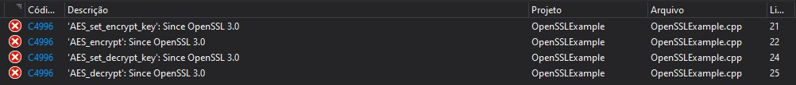

# AES OpenSSL

### Requerimentos:

1. Baixar e instalar Visual Studio (Usei a versão Community 2019)
2. Após instalar pacotes de Desenvolvimento para Desktop com C++ e Desenvolvimento para Linux com C++

3. Baixar e instalar Strawberry Perl x64 (https://strawberryperl.com/) - Utilizei a versão 5.32.1.1
4. Baixar e instalar Nasm Stable x64 (https://www.nasm.us/) - Utilizei a versão 2.15.05

5. Adicionar Perl (adiciona automaticamente) e Nasm no PATH (variáveis do sistema).

Nasm Dir: `C:\Users\<Username>\AppData\Local\bin\NASM`

6. Execute no prompt de comando (para verificar se tudo (Perl, Nasm e nmake) estão instalados corretamente):

```bash
perl --version
nasm --version
nmake /?
```

### Compilando OpenSSL:

1. Clone OpenSSL from Git

```bash
git clone https://github.com/openssl/openssl.git
```

2. Coloque em um diretório a saída da compilação do OpenSSL, por exemplo: "D:\out\"
Nessa pasta crie uma pasta "Lib" dentro dela "x64" e "Debug", ficando:
D:\out\Lib\x64\Debug

3. Criar outro diretório "SSL" dentro da pasta "D:\out" ficando:
D:\out\SSL

4. Abrir x64 Native tools command prompt for VS 2019 (no menu Iniciar)

5. E executar (neste terminal):

```bash
cpan -i Text::Template
cpan -i Test::More
```

6. Colocar o arquivo "build-debug-x64.bat" (presente neste repositório) na pasta que foi clonada anteriormente do OpenSSL:

No qual tem o seguinte conteúdo:

```bash
nmake clean
perl Configure VC-WIN64A --prefix=D:\out\Lib\x64\Release --openssldir=D:\out\SSL no-shared
nmake test
nmake install_sw
```

7. Caso o diretório criado anteriormente para a saída da compilação do OpenSSL seja diferente troque o diretório.

8. Troque de pasta no terminal (do passo 5) para a pasta do projeto OpenSSL clonado. Algo como:
cd C:\path\to\repository\openSSL\

9. Execute o "build-degug-x64.bat" (deve demorar diversos minutos)

#### OPCIONAL:

Caso queira executar todas as possibilidades (para Windows 32 bits e queira projeto para Release no Visual Studio) utilize o arquivo build.bat criando as pastas dentro de D:\out:
```
DLL/x32/Debug
DLL/x32/Realease
DLL/x64/Debug
DLL/x64/Realease
Lib/x32/Debug
Lib/x32/Realease
Lib/x64/Debug
Lib/x64/Realease
SSL
```

Você pode criar em outro lugar se preferir, apenas trocando no arquivo `.bat` a pasta.

10. Coloque as pastas `DLL` (opcional) e `Lib` onde você deseja guardar suas bibliotecas. Neste caso coloquei dentro do próprio projeto do Visual Studio (a seguir).

### Criando o projeto no Visual Studio

1. Abrir o Visual Studio.

2. Criar um Novo Projeto.

3. Selecionar a opção de "Aplicativo de Console" 

4. Colocar um nome para o projeto: "OpenSSLExample" (salvado em D:\OpenSSLExample)

Nessa parte você já deve ter copiado as pastas compiladas do OpenSSL para o projeto ou para outro lugar.

5. Ao lado direito da tela, clicar sobre o nome do projeto e ir em propriedades.

6. Na configuração Debug e Plataforma x64 (na parte superior da janela que abriu)

7. Clicar no menu lateral C/C++

8. Na linha "Diretórios de Inclusão Adicionais" (Additional Include Directories)

9. Clique e selecione a opção Editar... (Edit...)

10. Adicione o local da pasta compilada do OpenSSL, algo como: `D:\OpenSSLExample\Lib\x64\Debug\include`

11. Após vá no menu lateral Vinculador (Linker)

12. Depois no submenu Entrada (Input)

13. Adicione as libs em Dependências Adicionais (Additional Dependencies)

14. Clique e selecione a opção Editar... (Edit...)

15. Adicione as seguintes libs:
`D:\OpenSSLExample\Lib\x64\Debug\lib\libcrypto.lib`
`D:\OpenSSLExample\Lib\x64\Debug\lib\libssl.lib`

16. Salvar

#### OPCIONAL: 

Caso fez o opcional no passo anterior (para compilar tanto para 32 bits e Release), então salve e edite na parte superior a opção Debug e Release e selecione a pastas de acordo.

### Código

É possível testar qualquer código que realiza criptografia utilizando OpenSSL.

<details>
  <summary>SHA256</summary>
  
  ```cpp
    #include <iostream>
    #include <iomanip>
    #include <sstream>
    #include <string>
  
    using namespace std;
  
    #include <openssl/sha.h>
    string sha256(const string str)
    {
        unsigned char hash[SHA256_DIGEST_LENGTH];
        SHA256_CTX sha256;
        SHA256_Init(&sha256);
        SHA256_Update(&sha256, str.c_str(), str.size());
        SHA256_Final(hash, &sha256);
        stringstream ss;
    
        for(int i = 0; i < SHA256_DIGEST_LENGTH; i++)
        {
            ss << hex << setw(2) << setfill('0') << (int)hash[i];
        }
        return ss.str();
    }

    int main() {
        cout << sha256("1234567890_1") << endl;
        cout << sha256("1234567890_2") << endl;
        cout << sha256("1234567890_3") << endl;
        cout << sha256("1234567890_4") << endl;
        return 0;
    }
  ```
  
Código retirado de https://stackoverflow.com/questions/2262386/generate-sha256-with-openssl-and-c/10632725
  
Alguns problemas que podem ser encontrados:

- SHA256_DIGEST_LENGTH is not defined

Basta colocar no início do código o seguinte:

```cpp
#define SHA256_DIGEST_LENGTH 32
```

- 

Basta colocar no início do código o seguinte:

```cpp
#pragma warning(disable : 4996)
```

</details>


<details>
  <summary>AES (Criptografia simétrica)</summary>
  
  ```cpp
#include <iostream>
#include <stdio.h> 
#include <openssl/aes.h>   

using namespace std;

static const unsigned char key[] = {
    0x00, 0x11, 0x22, 0x33, 0x44, 0x55, 0x66, 0x77,
    0x88, 0x99, 0xaa, 0xbb, 0xcc, 0xdd, 0xee, 0xff,
    0x00, 0x01, 0x02, 0x03, 0x04, 0x05, 0x06, 0x07,
    0x08, 0x09, 0x0a, 0x0b, 0x0c, 0x0d, 0x0e, 0x0f
};

int main() {
    unsigned char text[] = "hello world!";
    unsigned char enc_out[80];
    unsigned char dec_out[80];

    AES_KEY enc_key, dec_key;

    AES_set_encrypt_key(key, 128, &enc_key);
    AES_encrypt(text, enc_out, &enc_key);

    AES_set_decrypt_key(key, 128, &dec_key);
    AES_decrypt(enc_out, dec_out, &dec_key);

    int i;

    printf("original text:\t");
    cout << text << endl;

    printf("original:\t");
    for (i = 0; *(text + i) != 0x00; i++)
        printf("%X ", *(text + i));
    printf("\nencrypted:\t");
    for (i = 0; *(enc_out + i) != 0x00; i++)
        printf("%X ", *(enc_out + i));
    printf("\ndecrypted:\t");
    for (i = 0; *(dec_out + i) != 0x00; i++)
        printf("%X ", *(dec_out + i));
    printf("\n");

    return 0;
}

```

Código retirado de: https://stackoverflow.com/questions/9889492/how-to-do-encryption-using-aes-in-openssl

Problema que pode ocorrer:

- 

Basta colocar no início do código o seguinte:

```cpp
#pragma warning(disable : 4996)
```

</details>

### Finalidade, Descrição do Problema e Execução

Esse projeto foi criado para realizar um trabalho da cadeira de Sistemas Distribuídos, com a ajuda dos colegas Josiane Nicolodi e Antonio Richter. 

Para a criptografia simétrica foi utilizado o algoritmo de AES, dado uma chave aleatória, informou-se a chave e que seria criptografado usando AES 128 bits, após criptografou-se a mensagem que foi passada em texto plano anteriormente, obtendo "enc_out", ou seja, o texto criptografado, após utilizou-se a mesma chave e o texto critografado para obter novamente o mesmo texto plano, como pode ser observado na imagem a seguir.

Este algoritmo pode ser utilizado em diversos lugares, um dos mais conhecidos é na criptografia de SSL / TLS (mas utilizando AES 256 bits).

Inicialmente tivemos bastante trabalho para rodar o código, visto que alguns executam apenas no Linux, por ser Windows foi mais complicado rodar alguns códigos, mas no fim chegamos neste resultado. 

Deu alguns problemas executando o que levou um pouco mais de tempo para concluir este trabalho, os mesmos estão documentos mais acima.

#### Execução do projeto AES:


- Mostra a mensagem em texto plano.
- Mostra a mensagem original em Hexadecimal.
- Mostra a mensagem criptografado em Hexadecimal.
- Mostra a mensagem descriptografada em Hexadecimal.
